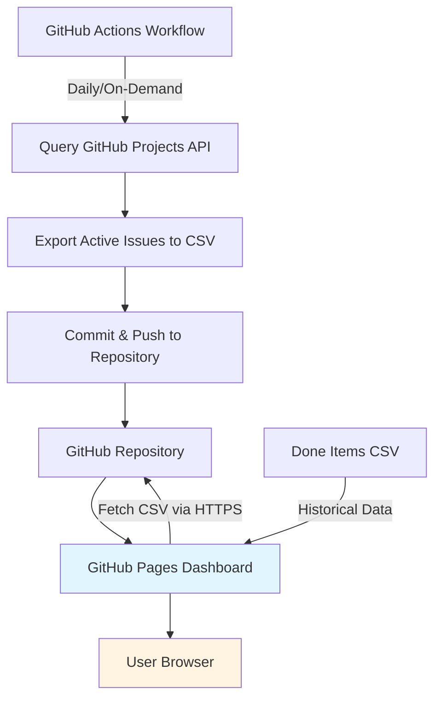

# Active Issues Dashboard - Complete Specification

## Overview

A GitHub Pages-based dashboard for visualizing and analyzing active work across multiple GitHub Projects, with capacity planning, velocity tracking, and deadline feasibility analysis.

---

## 1. Architecture



### Components

1. **Data Collection Layer** (GitHub Actions)
   - Workflow: `.github/workflows/export-active-items.yml`
   - Queries GitHub Projects API for active issues
   - Exports to CSV files in `exports/` directory
   - Runs daily at 00:00 UTC + on-demand via workflow_dispatch

2. **Data Storage Layer** (Git Repository)
   - Active issues: `exports/active-issues-{org}-{project}.csv`
   - Historical data: `exports/{org}-{project}-done-items.csv`
   - All data version-controlled in git

3. **Presentation Layer** (GitHub Pages)
   - Static HTML dashboard: `docs/dashboard.html`
   - Client-side JavaScript (no backend required)
   - Hosted at: `https://kubesmarts.github.io/pm-automations/dashboard.html`

---

## 2. Data Model

### Active Issues CSV Schema

Based on the done-items CSV structure with additions for Status and Remaining Work:

```csv
Issue Number,Parent Issue,Issue URL,Title,Assignees,Status,Type,Area,Priority,Initiative,Version,Size,Estimate,Time Spent,Remaining Work,Σ Estimate,Σ Time Spent,Σ Remaining Work,External Reference,Comments
```

**Field Descriptions:**
- `Issue Number`: GitHub issue number
- `Parent Issue`: Parent issue number (if sub-issue)
- `Issue URL`: GitHub issue URL
- `Title`: Issue title
- `Assignees`: Assigned user(s), comma-separated
- `Status`: Current status (e.g., "In Progress", "To Do", "Blocked") - **NEW**
- `Type`: Issue type
- `Area`: Team/area (e.g., "Runtimes", "Cloud", "Tooling")
- `Priority`: Priority level (e.g., "Blocker", "Major", "Normal")
- `Initiative`: Initiative name
- `Version`: Target version/milestone (e.g., "2026/Q2", "1.38.0 OSL")
- `Size`: Size estimate (XS, S, M, L, XL)
- `Estimate`: Original estimate in weeks
- `Time Spent`: Actual time spent in weeks
- `Remaining Work`: Remaining work in weeks (Estimate - Time Spent) - **NEW**
- `Σ Estimate`: Σ Estimate (parent + all descendants) - **NEW**
- `Σ Time Spent`: Σ Time Spent (parent + all descendants) - **NEW**
- `Σ Remaining Work`: Σ Remaining Work (parent + all descendants) - **NEW**
- `External Reference`: External reference (e.g., JIRA ticket)
- `Comments`: Additional comments

**Notes:**
- Project and organization are inferred from the filename (e.g., `kiegroup-8-active-items.csv`)
- Σ (Sigma) fields are calculated aggregations including parent + all descendants
- CSV structure matches done-items format for consistency

### Active Issues Definition

**Included:**
- Status NOT IN ("Backlog", "Done", "Cancelled")
- Has GitHub issue number (not draft cards)
- Has Remaining Work > 0 OR Status = "In Progress"

**Excluded:**
- Status = "Backlog"
- Status = "Done"
- Status = "Cancelled"
- Draft cards (no issue number)

---

## 3. Dashboard Features

### 3.1 Multi-Select Filters

**Filter Controls:**
```
┌─────────────────────────────────────────────────────────┐
│ FILTERS                                                 │
├─────────────────────────────────────────────────────────┤
│ Projects:     [✓] All  [ ] kiegroup-8  [ ] kiegroup-9  │
│ Versions:     [✓] 2026/Q2  [✓] 2026/Q3  [ ] 2026/Q4    │
│ Areas:        [✓] All  [ ] Runtimes  [ ] Cloud         │
│ Priorities:   [✓] All  [ ] Blocker  [ ] Major          │
│ Assignees:    [✓] All  [ ] user1  [ ] user2            │
│ Status:       [✓] In Progress  [✓] To Do  [ ] Blocked  │
└─────────────────────────────────────────────────────────┘
```

**Filter Behavior:**
- Multi-select checkboxes for all dimensions
- "All" checkbox to select/deselect all options
- Filters apply immediately (no "Apply" button needed)
- URL parameters preserve filter state for sharing

### 3.2 Global Summary View

```
┌─────────────────────────────────────────────────────────┐
│ GLOBAL SUMMARY                                          │
├─────────────────────────────────────────────────────────┤
│ Total Issues:           45                              │
│ Total Σ Remaining Work: 12.5 weeks                      │
│ Total Σ Estimate:       18.3 weeks                      │
│ Total Σ Time Spent:     5.8 weeks                       │
│ Progress:               32% complete (5.8 / 18.3)       │
└─────────────────────────────────────────────────────────┘
```

### 3.3 Breakdown Views

#### By Project
```
Project       | Issues | Σ Remaining | Σ Estimate | Progress | % of Total
--------------|--------|-------------|------------|----------|------------
kiegroup-8    | 18     | 5.2 weeks   | 8.1 weeks  | 64%      | 41.6%
kiegroup-9    | 15     | 4.1 weeks   | 6.2 weeks  | 66%      | 32.8%
quarkiverse-11| 12     | 3.2 weeks   | 4.0 weeks  | 80%      | 25.6%
```

#### By Version
```
Version    | Issues | Σ Remaining | Σ Estimate | Progress | % of Total
-----------|--------|-------------|------------|----------|------------
2026/Q2    | 25     | 7.5 weeks   | 11.2 weeks | 67%      | 60.0%
2026/Q3    | 12     | 3.8 weeks   | 5.1 weeks  | 75%      | 30.4%
Future     | 8      | 1.2 weeks   | 2.0 weeks  | 60%      | 9.6%
```

#### By Area
```
Area       | Issues | Σ Remaining | Σ Estimate | Progress | % of Total
-----------|--------|-------------|------------|----------|------------
Runtimes   | 18     | 5.2 weeks   | 7.8 weeks  | 67%      | 41.6%
Cloud      | 15     | 4.1 weeks   | 6.5 weeks  | 63%      | 32.8%
Tooling    | 12     | 3.2 weeks   | 4.0 weeks  | 80%      | 25.6%
```

#### By Priority
```
Priority   | Issues | Σ Remaining | Σ Estimate | Progress | % of Total
-----------|--------|-------------|------------|----------|------------
Blocker    | 5      | 2.1 weeks   | 3.2 weeks  | 66%      | 16.8%
Major      | 18     | 6.4 weeks   | 9.5 weeks  | 67%      | 51.2%
Normal     | 22     | 4.0 weeks   | 5.6 weeks  | 71%      | 32.0%
```

#### By Assignee
```
Assignee   | Issues | Σ Remaining | Σ Estimate | Progress | Areas
-----------|--------|-------------|------------|----------|------------------
user1      | 8      | 3.5 weeks   | 5.2 weeks  | 67%      | Runtimes, Cloud
user2      | 6      | 2.8 weeks   | 4.1 weeks  | 68%      | Tooling
user3      | 9      | 4.5 weeks   | 6.8 weeks  | 66%      | Runtimes, Tooling
unassigned | 4      | 1.7 weeks   | 2.2 weeks  | 77%      | Various
```

### 3.4 Capacity Planning & Deadline Feasibility

**Input Controls:**
```
┌─────────────────────────────────────────────────────────┐
│ CAPACITY PLANNING                                       │
├─────────────────────────────────────────────────────────┤
│ Target Date:     [2026-06-30] (End of Q2)              │
│ Team Size:       [3] people                             │
│ Availability:    [100]% (per person)                    │
│                                                         │
│ [Calculate Feasibility]                                 │
└─────────────────────────────────────────────────────────┘
```

**Feasibility Analysis:**
```
┌─────────────────────────────────────────────────────────┐
│ FEASIBILITY ANALYSIS                                    │
├─────────────────────────────────────────────────────────┤
│ Total Σ Remaining Work: 12.5 weeks                      │
│ Available Time:         8 weeks (from today to target)  │
│ Team Size:              3 people                        │
│ Team Capacity:          24 weeks (8 weeks × 3 people)   │
│                                                         │
│ Status: ✅ FEASIBLE (with 11.5 weeks buffer)           │
│ Utilization: 52% (12.5 / 24)                           │
│                                                         │
│ Risk Level: 🟢 LOW RISK                                │
│ - Buffer > 40%: Low risk                                │
│ - Buffer 20-40%: Medium risk                            │
│ - Buffer < 20%: High risk                               │
│ - Negative buffer: Not feasible                         │
└─────────────────────────────────────────────────────────┘
```

**Per-Area Capacity Analysis:**
```
┌─────────────────────────────────────────────────────────┐
│ PER-AREA CAPACITY                                       │
├─────────────────────────────────────────────────────────┤
│ Area      | Remaining | People | Capacity | Status      │
│-----------|-----------|--------|----------|-------------|
│ Runtimes  | 5.2w      | 2      | 16w      | ✅ 68% free │
│ Cloud     | 4.1w      | 1      | 8w       | ✅ 49% free │
│ Tooling   | 3.2w      | 1      | 8w       | ⚠️  60% used│
└─────────────────────────────────────────────────────────┘
```

**Per-Person Capacity Analysis:**
```
┌─────────────────────────────────────────────────────────┐
│ PER-PERSON CAPACITY                                     │
├─────────────────────────────────────────────────────────┤
│ Person    | Remaining | Capacity | Utilization | Status │
│-----------|-----------|----------|-------------|--------|
│ user1     | 3.5w      | 8w       | 44%         | ✅     │
│ user2     | 2.8w      | 8w       | 35%         | ✅     │
│ user3     | 4.5w      | 8w       | 56%         | ⚠️      │
│ unassigned| 1.7w      | -        | -           | ❌     │
└─────────────────────────────────────────────────────────┘

Recommendations:
• Assign 1.7w of unassigned work
• Consider adding 0.5 person to Tooling area
• user3 is at 56% utilization - monitor workload
```

### 3.5 Velocity Tracking & Forecasting

**Velocity Calculation:**
- Data source: `exports/*-done-items.csv` files
- Metric: Time Spent per week (grouped by Reporting Date)
- Time windows: Last 4 weeks, Last 8 weeks, Last 12 weeks

**Velocity Display:**
```
┌─────────────────────────────────────────────────────────┐
│ TEAM VELOCITY (Last 4 Weeks)                           │
├─────────────────────────────────────────────────────────┤
│ Week of 2026-03-17: 2.8 weeks completed                │
│ Week of 2026-03-24: 3.1 weeks completed                │
│ Week of 2026-03-31: 2.5 weeks completed                │
│ Week of 2026-04-07: 3.3 weeks completed                │
│                                                         │
│ Average Velocity: 2.9 weeks/week                       │
│ Trend: ↗️ Increasing (+12% vs 4-week avg)              │
│ Standard Deviation: 0.3 weeks (±10%)                   │
└─────────────────────────────────────────────────────────┘
```

**Velocity Breakdown:**
```
┌─────────────────────────────────────────────────────────┐
│ VELOCITY BY AREA (4-week average)                      │
├─────────────────────────────────────────────────────────┤
│ Area       | Velocity    | Trend                       │
│------------|-------------|------------------------------|
│ Runtimes   | 1.2 w/week  | ↗️ +8%                      │
│ Cloud      | 0.9 w/week  | → Stable                    │
│ Tooling    | 0.8 w/week  | ↘️ -5%                      │
└─────────────────────────────────────────────────────────┘

┌─────────────────────────────────────────────────────────┐
│ VELOCITY BY PERSON (4-week average)                    │
├─────────────────────────────────────────────────────────┤
│ Person     | Velocity    | Trend                       │
│------------|-------------|------------------------------|
│ user1      | 1.1 w/week  | ↗️ +15%                     │
│ user2      | 0.9 w/week  | → Stable                    │
│ user3      | 0.9 w/week  | ↘️ -10%                     │
└─────────────────────────────────────────────────────────┘
```

**Velocity-Based Forecast:**
```
┌─────────────────────────────────────────────────────────┐
│ VELOCITY-BASED FORECAST                                 │
├─────────────────────────────────────────────────────────┤
│ Remaining Work:        12.5 weeks                       │
│ Average Velocity:      2.9 weeks/week                   │
│ Estimated Completion:  ~4.3 weeks (2026-05-12)         │
│                                                         │
│ Confidence Intervals (based on velocity variance):     │
│ • Best case (90th %ile):  3.8 weeks (2026-05-05)       │
│ • Expected (50th %ile):   4.3 weeks (2026-05-12)       │
│ • Worst case (10th %ile): 5.1 weeks (2026-05-19)       │
│                                                         │
│ Target Date: 2026-06-30                                │
│ Status: ✅ ON TRACK (6 weeks buffer)                   │
└─────────────────────────────────────────────────────────┘
```

**Burndown Chart:**
```
Σ Remaining Work (weeks)
20 │                                    
18 │ ●                                  
16 │   ●                                
14 │     ●                              
12 │       ●                            
10 │         ●                          
 8 │           ●                        
 6 │             ●                      
 4 │               ●                    
 2 │                 ●                  
 0 │___________________●________________
   Mar 1   Mar 15   Apr 1   Apr 15   May 1
   
   ● Actual    --- Ideal    ··· Forecast
```

### 3.6 Interactive Charts

**Chart Types:**

1. **Stacked Bar Chart** - Remaining Work by Dimension
   - X-axis: Project/Version/Area/Priority
   - Y-axis: Σ Remaining Work (weeks)
   - Stacks: Status (In Progress, To Do, Blocked)
   - Click to drill down

2. **Pie Chart** - Distribution by Dimension
   - Shows % of total remaining work
   - Dimensions: Project, Area, Priority, Assignee
   - Click slice to filter

3. **Burndown Chart** - Remaining Work Over Time
   - X-axis: Date
   - Y-axis: Σ Remaining Work
   - Lines: Actual, Ideal, Forecast
   - Shaded area: Confidence interval

4. **Velocity Chart** - Completion Rate Over Time
   - X-axis: Week
   - Y-axis: Work Completed (weeks)
   - Bars: Weekly completion
   - Line: Moving average

5. **Capacity Utilization** - Team Workload
   - X-axis: Person/Area
   - Y-axis: Utilization %
   - Bars: Current utilization
   - Line: Target utilization (80%)

### 3.7 Detailed Issue List

**Table View:**
```
┌─────────────────────────────────────────────────────────────────────────────────┐
│ FILTERED ISSUES (45 items)                                                      │
├─────────────────────────────────────────────────────────────────────────────────┤
│ # │ Title                    │ Status      │ Area     │ Priority │ Remaining │ │
│───┼──────────────────────────┼─────────────┼──────────┼──────────┼───────────┤ │
│391│ bug: Durable workflows...│ In Progress │ Runtimes │ Blocker  │ 0.3w      │ │
│48 │ feat: Add new feature... │ To Do       │ Cloud    │ Major    │ 1.2w      │ │
│...│ ...                      │ ...         │ ...      │ ...      │ ...       │ │
└─────────────────────────────────────────────────────────────────────────────────┘

[Export to CSV] [Copy to Clipboard]
```

**Sortable Columns:**
- Issue Number
- Title
- Status
- Area
- Priority
- Version
- Assignee
- Σ Remaining Work
- Progress %

**Row Actions:**
- Click row to open GitHub issue in new tab
- Hover to see full details tooltip

---

## 4. Technical Implementation

### 4.1 Technology Stack

**Frontend:**
- HTML5 + CSS3 (responsive design)
- JavaScript (ES6+, no build step required)
- Libraries:
  - [PapaParse](https://www.papaparse.com/) - CSV parsing
  - [Chart.js](https://www.chartjs.org/) - Interactive charts
  - [DataTables](https://datatables.net/) - Sortable/filterable tables
  - No jQuery dependency (vanilla JS)

**Data Processing:**
- Client-side CSV parsing
- In-memory data aggregation
- URL parameters for state management

**Hosting:**
- GitHub Pages (static site)
- No backend server required
- HTTPS by default

### 4.2 File Structure

```
pm-automations/
├── .github/
│   └── workflows/
│       ├── export-active-items.yml       # New workflow
│       ├── export-done-items.yml         # Existing
│       └── sync-project-reporting-metrics.yml  # Existing
├── docs/
│   ├── dashboard.html                    # Main dashboard
│   ├── dashboard.css                     # Styles
│   ├── dashboard.js                      # Main logic
│   ├── charts.js                         # Chart rendering
│   ├── capacity.js                       # Capacity planning
│   ├── velocity.js                       # Velocity tracking
│   └── dashboard-specification.md        # This document
├── exports/
│   ├── active-issues-kiegroup-8.csv      # Active issues
│   ├── active-issues-kiegroup-9.csv
│   ├── active-issues-kubesmarts-1.csv
│   ├── active-issues-quarkiverse-11.csv
│   ├── kiegroup-8-done-items.csv         # Historical data
│   ├── kiegroup-9-done-items.csv
│   ├── kubesmarts-1-done-items.csv
│   └── quarkiverse-11-done-items.csv
└── README.md
```

### 4.3 Workflow: Export Active Issues

**File:** `.github/workflows/export-active-items.yml`

**Trigger:**
- Schedule: Daily at 00:00 UTC
- Manual: workflow_dispatch

**Steps:**
1. Query GitHub Projects API for each configured project
2. Filter for active issues (Status NOT IN Backlog/Done/Cancelled)
3. Extract all required fields
4. Export to CSV: `exports/active-issues-{org}-{project}.csv`
5. Commit and push changes

**GraphQL Query:**
```graphql
query($org: String!, $number: Int!) {
  organization(login: $org) {
    projectV2(number: $number) {
      items(first: 100) {
        nodes {
          id
          content {
            ... on Issue {
              number
              title
              url
              repository {
                owner { login }
                name
              }
            }
          }
          fieldValues(first: 50) {
            nodes {
              ... on ProjectV2ItemFieldTextValue {
                field { name }
                text
              }
              ... on ProjectV2ItemFieldNumberValue {
                field { name }
                number
              }
              ... on ProjectV2ItemFieldSingleSelectValue {
                field { name }
                name
              }
            }
          }
        }
      }
    }
  }
}
```

### 4.4 Dashboard JavaScript Architecture

**Main Components:**

1. **DataLoader** (`dashboard.js`)
   - Fetches CSV files from repository
   - Parses CSV using PapaParse
   - Caches data in memory
   - Handles errors gracefully

2. **FilterManager** (`dashboard.js`)
   - Manages filter state
   - Updates URL parameters
   - Applies filters to data
   - Triggers re-render on change

3. **AggregationEngine** (`dashboard.js`)
   - Groups data by dimensions
   - Calculates sums and averages
   - Computes percentages
   - Handles missing values

4. **ChartRenderer** (`charts.js`)
   - Creates Chart.js instances
   - Updates charts on filter change
   - Handles chart interactions
   - Responsive sizing

5. **CapacityPlanner** (`capacity.js`)
   - Calculates team capacity
   - Computes utilization
   - Determines feasibility
   - Generates recommendations

6. **VelocityTracker** (`velocity.js`)
   - Loads historical data
   - Calculates velocity metrics
   - Computes trends
   - Generates forecasts

**Data Flow:**
```
User Action → FilterManager → AggregationEngine → ChartRenderer
                                                 → TableRenderer
                                                 → CapacityPlanner
                                                 → VelocityTracker
```

### 4.5 Performance Considerations

**Optimization Strategies:**
1. **Lazy Loading**: Load CSV files only when needed
2. **Caching**: Cache parsed data in memory
3. **Debouncing**: Debounce filter changes (300ms)
4. **Virtual Scrolling**: For large issue lists (>1000 items)
5. **Web Workers**: For heavy computations (velocity, forecasting)

**Expected Performance:**
- Initial load: < 2 seconds
- Filter change: < 100ms
- Chart update: < 200ms
- CSV size: ~50KB per project (500 issues)

---

## 5. Configuration

### 5.1 GitHub Pages Setup

**Enable GitHub Pages:**
1. Go to repository Settings → Pages
2. Source: Deploy from a branch
3. Branch: `main` / `docs` folder
4. Save

**Access URL:**
- `https://kubesmarts.github.io/pm-automations/dashboard.html`

### 5.2 Workflow Configuration

**Environment Variables** (in repository settings):
```yaml
PSYNC_PAT_GH: <GitHub PAT with project read access>
PSYNC_PROJECTS: "kiegroup:8,kiegroup:9,kubesmarts:1,quarkiverse:11"
```

**Workflow Schedule:**
```yaml
on:
  schedule:
    - cron: '0 0 * * *'  # Daily at 00:00 UTC
  workflow_dispatch:      # Manual trigger
```

### 5.3 Team Configuration

**Capacity Planning Settings** (in dashboard UI):
- Stored in browser localStorage
- Configurable per user
- Default values:
  - Team size: 3 people
  - Availability: 100% per person
  - Working days: 5 days/week

**Area-to-Person Mapping:**
- Configured in dashboard UI
- Stored in localStorage
- Used for per-area capacity calculation

---

## 6. User Workflows

### 6.1 Sprint Planning

**Scenario:** Planning work for Q2 2026

1. Open dashboard
2. Select filters:
   - Versions: [✓] 2026/Q2
   - Status: [✓] To Do, [✓] In Progress
3. Review Global Summary:
   - Total Σ Remaining Work: 7.5 weeks
4. Check Capacity Planning:
   - Target Date: 2026-06-30
   - Team Size: 3 people
   - Result: ✅ FEASIBLE (11.5 weeks buffer)
5. Review Per-Area Breakdown:
   - Identify overloaded areas
6. Review Per-Person Breakdown:
   - Identify unassigned work
7. Make assignments in GitHub Projects
8. Re-run workflow to update dashboard

### 6.2 Progress Monitoring

**Scenario:** Weekly progress check

1. Open dashboard
2. Select filters:
   - Versions: [✓] 2026/Q2
3. Review Velocity:
   - Last 4 weeks average: 2.9 w/week
   - Trend: ↗️ Increasing
4. Check Burndown Chart:
   - Compare actual vs ideal
5. Review Forecast:
   - Estimated completion: 2026-05-12
   - Status: ✅ ON TRACK
6. Identify blockers:
   - Filter by Status: [✓] Blocked
7. Take action on blocked items

### 6.3 Resource Planning

**Scenario:** Determining if more people are needed

1. Open dashboard
2. Select filters:
   - Versions: [✓] 2026/Q2, [✓] 2026/Q3
3. Review Capacity Planning:
   - Total Σ Remaining Work: 11.3 weeks
   - Team Capacity: 24 weeks
   - Utilization: 47%
4. Check Per-Area Capacity:
   - Tooling: ⚠️ 60% utilized
5. Adjust team size in UI:
   - Add 1 person to Tooling
   - New utilization: 40%
6. Decision: Add 1 person to Tooling area

### 6.4 Milestone Risk Assessment

**Scenario:** Assessing risk for Q2 delivery

1. Open dashboard
2. Select filters:
   - Versions: [✓] 2026/Q2
3. Review Capacity Planning:
   - Target Date: 2026-06-30
   - Status: ⚠️ TIGHT (2 weeks buffer)
4. Check Velocity Forecast:
   - Worst case: 2026-06-15 (2 weeks before target)
   - Best case: 2026-05-28 (4 weeks before target)
5. Review Per-Priority Breakdown:
   - Blocker: 2.1 weeks (16.8%)
   - Major: 6.4 weeks (51.2%)
6. Decision: Focus on Blocker items first

---

## 7. Testing Plan

### 7.1 Unit Tests

**Test Coverage:**
- Data parsing (CSV to objects)
- Filtering logic
- Aggregation calculations
- Capacity planning formulas
- Velocity calculations
- Forecast algorithms

**Test Framework:**
- Jest or Mocha (for Node.js testing)
- Browser-based testing (for DOM interactions)

### 7.2 Integration Tests

**Test Scenarios:**
1. Load CSV files from repository
2. Apply filters and verify results
3. Generate charts and verify data
4. Calculate capacity and verify feasibility
5. Calculate velocity and verify forecast
6. Export filtered data to CSV

### 7.3 Manual Testing

**Test Cases:**
1. **Filter Combinations**
   - Test all filter combinations
   - Verify correct data displayed
   - Verify URL parameters updated

2. **Chart Interactions**
   - Click chart segments
   - Verify drill-down behavior
   - Verify tooltips

3. **Capacity Planning**
   - Adjust team size
   - Adjust target date
   - Verify feasibility calculation

4. **Velocity Tracking**
   - Verify velocity calculation
   - Verify trend detection
   - Verify forecast accuracy

5. **Responsive Design**
   - Test on desktop (1920x1080)
   - Test on tablet (768x1024)
   - Test on mobile (375x667)

---

## 8. Deployment Plan

### 8.1 Phase 1: Data Export (Week 1)

**Tasks:**
1. Create `export-active-items.yml` workflow
2. Test GraphQL queries
3. Implement CSV export logic
4. Test with all configured projects
5. Verify CSV format and data quality

**Deliverables:**
- Working workflow
- CSV files in `exports/` directory
- Documentation

### 8.2 Phase 2: Basic Dashboard (Week 2)

**Tasks:**
1. Create `dashboard.html` with basic layout
2. Implement data loading and parsing
3. Implement filter controls
4. Implement global summary view
5. Implement breakdown tables

**Deliverables:**
- Basic dashboard with filters
- Summary and breakdown views
- Documentation

### 8.3 Phase 3: Charts & Visualizations (Week 3)

**Tasks:**
1. Implement stacked bar charts
2. Implement pie charts
3. Implement burndown chart
4. Implement velocity chart
5. Implement capacity utilization chart

**Deliverables:**
- Interactive charts
- Chart interactions (click, hover)
- Documentation

### 8.4 Phase 4: Capacity Planning (Week 4)

**Tasks:**
1. Implement capacity planning UI
2. Implement feasibility calculation
3. Implement per-area capacity analysis
4. Implement per-person capacity analysis
5. Implement recommendations engine

**Deliverables:**
- Capacity planning feature
- Feasibility analysis
- Documentation

### 8.5 Phase 5: Velocity Tracking (Week 5)

**Tasks:**
1. Load historical data from done-items CSV
2. Implement velocity calculation
3. Implement trend detection
4. Implement forecast algorithm
5. Implement confidence intervals

**Deliverables:**
- Velocity tracking feature
- Forecast with confidence intervals
- Documentation

### 8.6 Phase 6: Polish & Documentation (Week 6)

**Tasks:**
1. Responsive design improvements
2. Performance optimization
3. Error handling improvements
4. User documentation
5. Testing and bug fixes

**Deliverables:**
- Production-ready dashboard
- Complete documentation
- Test results

---

## 9. Future Enhancements

### 9.1 Advanced Features

1. **Historical Snapshots**
   - Store daily snapshots of active issues
   - Show how remaining work changes over time
   - Compare current vs previous snapshots

2. **Alerts & Notifications**
   - Email alerts for at-risk milestones
   - Slack notifications for capacity issues
   - GitHub issue comments for blockers

3. **Custom Metrics**
   - User-defined KPIs
   - Custom aggregations
   - Custom charts

4. **Export & Reporting**
   - PDF export of dashboard
   - PowerPoint export of charts
   - Scheduled email reports

5. **Team Collaboration**
   - Comments on dashboard
   - Shared filter presets
   - Team annotations

### 9.2 Integration Opportunities

1. **JIRA Integration**
   - Sync capacity planning to JIRA
   - Import JIRA velocity data
   - Bi-directional sync

2. **Slack Integration**
   - Daily standup reports
   - Weekly progress summaries
   - Alert notifications

3. **Calendar Integration**
   - Sync milestones to Google Calendar
   - Show team availability
   - Block time for high-priority work

---

## 10. Success Metrics

### 10.1 Adoption Metrics

- Dashboard page views per week
- Unique users per week
- Average session duration
- Filter usage frequency

### 10.2 Impact Metrics

- Reduction in missed deadlines
- Improvement in capacity utilization
- Reduction in unassigned work
- Improvement in velocity predictability

### 10.3 User Satisfaction

- User feedback surveys
- Feature requests
- Bug reports
- Net Promoter Score (NPS)

---

## 11. Maintenance & Support

### 11.1 Regular Maintenance

**Daily:**
- Monitor workflow execution
- Check for CSV export errors
- Verify dashboard accessibility

**Weekly:**
- Review dashboard usage metrics
- Check for data quality issues
- Update documentation as needed

**Monthly:**
- Review and update capacity planning defaults
- Analyze velocity trends
- Update forecast algorithms if needed

### 11.2 Support Channels

- GitHub Issues for bug reports
- GitHub Discussions for questions
- Slack channel for real-time support
- Documentation wiki for self-service

---

## Appendix A: Sample Data

### Active Issues CSV Sample

```csv
Project,Org,Project_Number,Issue_Number,Title,Status,Area,Priority,Version,Assignee,Estimate,Time_Spent,Remaining_Work,Sigma_Estimate,Sigma_Time_Spent,Sigma_Remaining_Work,URL,Parent_Issue,Type,Initiative,Size,External_Reference
kiegroup-8,kiegroup,8,391,bug: Durable workflows in devmode are timing out,In Progress,Runtimes,Blocker,2026/Q2,user1,0.3,0.3,0.0,0.3,0.3,0.0,https://github.com/quarkiverse/quarkus-flow/issues/391,,,OSL,S,SRVLOGIC-914
kiegroup-8,kiegroup,8,48,feat: Add new feature,To Do,Cloud,Major,2026/Q2,user2,1.5,0.0,1.5,1.5,0.0,1.5,https://github.com/serverlessworkflow/editor/issues/48,,,CNCF Spec,L,
```

### Done Items CSV Sample

```csv
Issue Number,Parent Issue,Issue URL,Title,Assignees,Type,Area,Priority,Initiative,Version,Size,Estimate,Time Spent,Reporting Date,External Reference,Comments
221,,https://github.com/serverlessworkflow/sdk-go/issues/221,Add an implementation reference to the DSL 1.0.0,ricardozanini,,Cloud,Normal,CNCF Spec,Future,XL,0,0,2026-03-27,,
```

---

## Appendix B: Technology Alternatives

### Alternative Chart Libraries

1. **D3.js**
   - Pros: Highly customizable, powerful
   - Cons: Steeper learning curve, larger bundle size
   - Use case: Complex custom visualizations

2. **Plotly.js**
   - Pros: Interactive, 3D charts, statistical charts
   - Cons: Larger bundle size
   - Use case: Scientific/statistical visualizations

3. **ApexCharts**
   - Pros: Modern, responsive, good defaults
   - Cons: Less mature than Chart.js
   - Use case: Modern web apps

**Recommendation:** Chart.js for simplicity and performance

### Alternative CSV Parsers

1. **csv-parse**
   - Pros: Node.js native, streaming support
   - Cons: Requires build step for browser
   - Use case: Server-side processing

2. **Papa Parse**
   - Pros: Browser-native, streaming, error handling
   - Cons: Slightly larger than alternatives
   - Use case: Client-side CSV parsing

**Recommendation:** Papa Parse for browser compatibility

---

## Appendix C: Glossary

- **Active Issue**: Issue with Status NOT IN (Backlog, Done, Cancelled)
- **Σ (Sigma)**: Sum of parent + all descendant issues
- **Remaining Work**: Estimate - Time Spent
- **Velocity**: Work completed per time period (weeks/week)
- **Capacity**: Available team time (people × weeks)
- **Utilization**: Remaining Work / Capacity
- **Feasibility**: Whether work can be completed by target date
- **Buffer**: Capacity - Remaining Work
- **Burndown**: Remaining work over time
- **Forecast**: Predicted completion date based on velocity
- **Confidence Interval**: Range of likely completion dates

---

**Document Version:** 1.0  
**Last Updated:** 2026-04-13  
**Author:** Bob (AI Planning Assistant)  
**Status:** Draft for Review